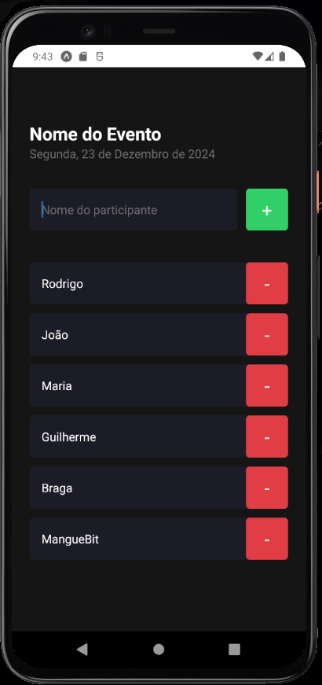

# Participant Manager
<div>
    
    
    
    
    
    
</div>

## Sobre
O **Participant Manager** é uma aplicação desenvolvida em React Native para gerenciamento de participantes de eventos. A aplicação permite adicionar e remover participantes e possui interface moderna.

## Requisitos e Como Rodar a Aplicação Localmente

### Pré-requisitos
- **Node.js** versão 16 ou superior
- **Expo CLI** instalado globalmente
- Um dispositivo físico ou emulador configurado

### Passos para Configuração

1. Clone o repositório:
    ```bash
    git clone https://github.com/guilhermevnbraga/ParticipantManager.git
    ```

2. Navegue até o diretório do projeto:
    ```bash
    cd ParticipantManager
    ```

3. Instale as dependências do projeto:
    ```bash
    npm install
    ```

4. Inicie o servidor Expo:
    ```bash
    npx expo start
    ```

5. Escaneie o QR Code no terminal com o aplicativo **Expo Go** no seu dispositivo físico, ou execute o projeto em um emulador configurado.

## Estrutura do Projeto

A estrutura do projeto é organizada da seguinte forma:

- **app/**: Contém o código principal da aplicação.
  - `index.tsx`: Componente principal que renderiza a aplicação.
  - `styles.ts`: Estilos globais usados no componente principal.
- **components/Participant/**: Contém o componente que gerencia os participantes.
  - `index.tsx`: Lógica e renderização do componente de participante.
  - `styles.ts`: Estilos específicos para o componente de participante.

## Preview do app

<div align="center">
    
</div>
